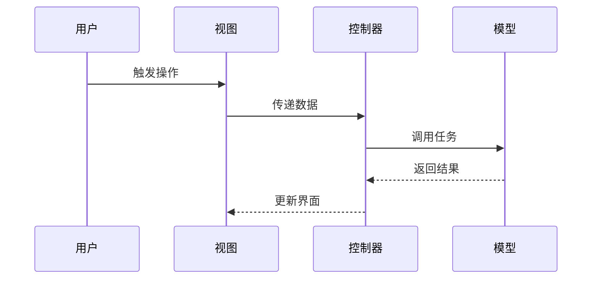

# 架构
按照MVC架构设计，将应用程序分为模型、视图和控制器三部分。
- View：一般继承自QWidget，负责处理用户界面，展示数据和接收用户输入。
- Controller：继承自QObject，方便定义信号和槽函数，持有一个View对象和多个子Controller对象，负责协调视图和模型之间的交互，处理用户输入并更新模型和视图。
- Model：广义的模型概念，负责处理数据逻辑，包括数据的存储、检索和操作。核心是脱离UI后可以直接运行完成任务，不依赖Qt框架，通过信号总线将数据变化通知给其他组件。

# MVC架构下的调用关系
